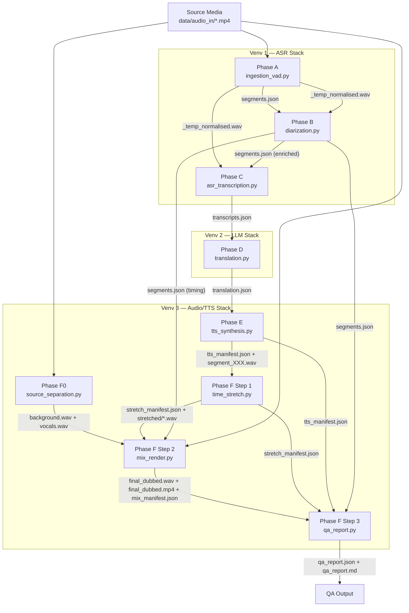

# Dubly ME — Architecture & Data Flow Map

> **Purpose:** Complete reference for a refactoring agent. Documents every phase, every data contract, every inter-phase coupling point, and every architectural inconsistency found in the current codebase.

---

## 1. High-Level Pipeline Topology



---

## 2. Per-Phase Data Flow Contracts

### Phase A — Ingestion & VAD
| | |
|---|---|
| **Script** | [ingestion_vad.py](file:///c:/Users/user/OneDrive/Desktop/Dubly_ME/src/ingestion_vad.py) |
| **Venv** | Venv 1 (ASR) |
| **Key Deps** | `torch`, `torchaudio`, `FFmpeg` (system) |

| Direction | Artifact | Path | Format |
|-----------|----------|------|--------|
| **Input** | Source media | `data/audio_in/<file>` | Any FFmpeg-supported |
| **Output** | Normalised audio | `data/audio_out/_temp_normalised.wav` | 16 kHz mono PCM WAV |
| **Output** | VAD segments | `artifacts/segments.json` | JSON data contract |

#### `segments.json` Schema (Phase A output)
```json
{
  "source_file": "sample.mp4",
  "generated_at": "ISO8601",
  "source_language": "ar|auto",
  "target_language": "en",
  "vad_model": "silero_vad_v5",
  "vad_threshold": 0.20,
  "total_segments": 10,
  "segments": [
    {
      "segment_id": 1,
      "start_time": 0.9,
      "end_time": 3.2,
      "duration": 2.3,
      "speaker_id": null,
      "text": null
    }
  ]
}
```

---

### Phase B — Speaker Diarization
| | |
|---|---|
| **Script** | [diarization.py](file:///c:/Users/user/OneDrive/Desktop/Dubly_ME/src/diarization.py) |
| **Venv** | Venv 1 (ASR) |
| **Key Deps** | `torch`, `torchaudio`, `pyannote.audio`, [torchaudio_compat.py](file:///c:/Users/user/OneDrive/Desktop/Dubly_ME/src/torchaudio_compat.py) |

| Direction | Artifact | Path | Format |
|-----------|----------|------|--------|
| **Input** | VAD segments | `artifacts/segments.json` | JSON |
| **Input** | Normalised audio | `data/audio_out/_temp_normalised.wav` | WAV |
| **Output** | Enriched segments | `artifacts/segments.json` (**overwrite**) | JSON |

#### Fields ADDED to `segments.json` by Phase B
- Per segment: `speaker_id` (e.g. `"SPEAKER_01"`), optional `_original_segment_id`, `_merged_from`
- Top-level: `diarization_model`, `diarization_completed_at`, `diarization_stats`

> [!IMPORTANT]
> **Phase B overwrites `segments.json` IN-PLACE** — the VAD output is replaced. This is a deliberate design choice (append metadata to the same contract), but it means the raw VAD output is lost after diarization runs.

---

### Phase C — ASR Transcription
| | |
|---|---|
| **Script** | [asr_transcription.py](file:///c:/Users/user/OneDrive/Desktop/Dubly_ME/src/asr_transcription.py) |
| **Venv** | Venv 1 (ASR) |
| **Key Deps** | `whisperx`, `torch`, `torchaudio_compat`, `numpy`, [language_registry.json](file:///c:/Users/user/OneDrive/Desktop/Dubly_ME/config/language_registry.json) |

| Direction | Artifact | Path | Format |
|-----------|----------|------|--------|
| **Input** | Diarised segments | `artifacts/segments.json` | JSON |
| **Input** | Normalised audio | `data/audio_out/_temp_normalised.wav` | WAV |
| **Input** | Language registry | `config/language_registry.json` | JSON |
| **Output** | Transcripts | `artifacts/transcripts.json` | JSON (**new file**) |

#### `transcripts.json` Schema (Phase C output)
Carries forward ALL fields from `segments.json` plus per-segment additions:
- `text` (populated), `asr_confidence`, `low_confidence_asr`
- `_rms_dbfs`, `_skipped_low_energy`, `_skipped_too_short`, `_hallucination_suspect`, `_prompt_echo_filtered`

Top-level additions: `source_language` (confirmed), `language_config`, `gate_stats`, `asr_model`, `align_model`, `asr_completed_at`

---

### Phase D — Translation & Adaptation
| | |
|---|---|
| **Script** | [translation.py](file:///c:/Users/user/OneDrive/Desktop/Dubly_ME/src/translation.py) |
| **Venv** | Venv 2 (LLM) |
| **Key Deps** | `torch`, `transformers`, `autoawq`, `bitsandbytes` |

| Direction | Artifact | Path | Format |
|-----------|----------|------|--------|
| **Input** | Transcripts | `artifacts/transcripts.json` | JSON |
| **Input** | Name glossary | `config/name_glossary.json` | JSON |
| **Output** | Translation | `artifacts/translation.json` | JSON (**new file**) |

#### `translation.json` Schema (Phase D output)
Carries forward ALL fields from `transcripts.json` plus per-segment additions:
- `translated_text`, `transcription_failed`, `low_confidence`, `_asr_hallucination`, `_asr_skipped`, `skip_translation`, `syllable_budget`, `_translation_skipped`

Top-level additions: `translation_model`, `translation_completed_at`, `source_language`, `target_language`, `name_glossary`

---

### Phase E — TTS Synthesis
| | |
|---|---|
| **Script** | [tts_synthesis.py](file:///c:/Users/user/OneDrive/Desktop/Dubly_ME/src/tts_synthesis.py) |
| **Venv** | Venv 3 (Audio/TTS) |
| **Key Deps** | `TTS` (Coqui), `torch`, `soundfile` |

| Direction | Artifact | Path | Format |
|-----------|----------|------|--------|
| **Input** | Translation | `artifacts/translation.json` | JSON |
| **Input** | Voice reference | `artifacts/voice_ref.wav` | WAV |
| **Input** | Source video | `data/audio_in/sample.mp4` | (for auto-extract) |
| **Input** | Speaker profiles | `voice_profiles/<SPEAKER_XX>.wav` | WAV |
| **Output** | Segment WAVs | `artifacts/audio_out/segment_XXX.wav` | WAV (22050 Hz) |
| **Output** | TTS manifest | `artifacts/tts_manifest.json` | JSON (**new file**) |

#### `tts_manifest.json` Schema (Phase E output)
```json
{
  "phase": "E",
  "tts_model": "tts_models/multilingual/multi-dataset/xtts_v2",
  "reference_audio": "...",
  "speaker_profiles": { "SPEAKER_01": "..." },
  "generated_at": "ISO8601",
  "total_segments": 55,
  "synthesized": 35,
  "skipped": 18,
  "failed": 0,
  "segments": [
    {
      "segment_id": 4,
      "status": "success|skipped|error",
      "speaker_id": "SPEAKER_02",
      "output_file": "artifacts/audio_out/segment_004.wav",
      "duration_s": 9.123,
      "original_duration_s": 10.3,
      "text": "..."
    }
  ]
}
```

> [!NOTE]
> Phase E writes a **structurally independent** manifest (not an augmented copy of translation.json). This is the cleanest data contract boundary in the pipeline.

---

### Phase F0 — Source Separation
| | |
|---|---|
| **Script** | [source_separation.py](file:///c:/Users/user/OneDrive/Desktop/Dubly_ME/src/source_separation.py) |
| **Venv** | Isolated Demucs venv (documented as `/content/.venv_demucs`) |
| **Key Deps** | `demucs`, `soundfile`, `numpy`, `scipy` (optional), `FFmpeg` |

| Direction | Artifact | Path | Format |
|-----------|----------|------|--------|
| **Input** | Source media | `data/audio_in/sample.mp4` | Any FFmpeg-supported |
| **Output** | Background bed | `artifacts/audio_out/background.wav` | Mono WAV @ 24 kHz |
| **Output** | Vocals stem | `artifacts/audio_out/vocals.wav` | Mono WAV @ 24 kHz |
| **Output** | Separation manifest | `artifacts/separation_manifest.json` | JSON |

> [!NOTE]
> Phase F0 runs **independently** from the main pipeline. Its outputs (background.wav, vocals.wav) are **optional** for Phase F2 — absent stems trigger fallback behavior (silent base, source-extract passthrough).

---

### Phase F Step 1 — Time Stretch
| | |
|---|---|
| **Script** | [time_stretch.py](file:///c:/Users/user/OneDrive/Desktop/Dubly_ME/src/time_stretch.py) |
| **Venv** | Venv 3 (Audio) |
| **Key Deps** | `soundfile`, `numpy`, `pyrubberband` (optional), `FFmpeg` |

| Direction | Artifact | Path | Format |
|-----------|----------|------|--------|
| **Input** | TTS manifest | `artifacts/tts_manifest.json` | JSON |
| **Input** | TTS WAVs | `artifacts/audio_out/segment_XXX.wav` | WAV |
| **Output** | Stretched WAVs | `artifacts/audio_out/stretched/segment_XXX.wav` | WAV |
| **Output** | Stretch manifest | `artifacts/stretch_manifest.json` | JSON (**new file**) |

---

### Phase F Step 2 — Final Mix & Render
| | |
|---|---|
| **Script** | [mix_render.py](file:///c:/Users/user/OneDrive/Desktop/Dubly_ME/src/mix_render.py) |
| **Venv** | Venv 3 (Audio) |
| **Key Deps** | `soundfile`, `numpy`, `scipy` (optional), `FFmpeg` |

| Direction | Artifact | Path | Format |
|-----------|----------|------|--------|
| **Input** | Stretch manifest | `artifacts/stretch_manifest.json` | JSON |
| **Input** | Segments (timing) | `artifacts/segments.json` | JSON |
| **Input** | Stretched WAVs | `artifacts/audio_out/stretched/` | WAV |
| **Input** | Source video | `data/audio_in/sample.mp4` | Video |
| **Input** | Background bed | `artifacts/audio_out/background.wav` | WAV (optional) |
| **Input** | Vocals stem | `artifacts/audio_out/vocals.wav` | WAV (optional) |
| **Output** | Dubbed audio | `data/audio_out/final_dubbed.wav` | WAV @ 24 kHz |
| **Output** | Dubbed video | `data/audio_out/final_dubbed.mp4` | MP4 (AAC 192k) |
| **Output** | Mix manifest | `artifacts/mix_manifest.json` | JSON |

---

### Phase F Step 3 — QA Report
| | |
|---|---|
| **Script** | [qa_report.py](file:///c:/Users/user/OneDrive/Desktop/Dubly_ME/src/qa_report.py) |
| **Venv** | Venv 3 (Audio) — stdlib only, no heavy deps |
| **Key Deps** | `json` (stdlib) |

| Direction | Artifact | Path | Format |
|-----------|----------|------|--------|
| **Input** | Segments | `artifacts/segments.json` | JSON |
| **Input** | TTS manifest | `artifacts/tts_manifest.json` | JSON |
| **Input** | Stretch manifest | `artifacts/stretch_manifest.json` | JSON |
| **Input** | Mix manifest | `artifacts/mix_manifest.json` | JSON |
| **Output** | QA report (JSON) | `artifacts/qa_report.json` | JSON |
| **Output** | QA report (MD) | `artifacts/qa_report.md` | Markdown |

---

## 3. Isolated Virtual Environments Map

| Venv | Scripts | Key Dependencies | Notes |
|------|---------|-----------------|-------|
| **Venv 1 — ASR** | `ingestion_vad.py`, `diarization.py`, `asr_transcription.py` | `torch 2.1.2`, `torchaudio 2.1.2`, `whisperx 3.3.1`, `pyannote.audio 3.1.1`, `faster-whisper`, `ctranslate2` | Heavy pin management via `torchaudio_compat.py` shim |
| **Venv 2 — LLM** | `translation.py` | `torch`, `transformers 4.47.1`, `autoawq 0.2.8`, `bitsandbytes`, `accelerate` | AWQ/GPTQ inference; `transformers` pinned at 4.47.1 to keep `PytorchGELUTanh` alive for AutoAWQ |
| **Venv 3 — Audio/TTS** | `tts_synthesis.py`, `time_stretch.py`, `mix_render.py`, `source_separation.py`, `qa_report.py` | `TTS` (Coqui), `soundfile`, `numpy`, `scipy`, `pyrubberband` (optional), `demucs` (F0 only) | Source separation documented to run in its own sub-venv (`/content/.venv_demucs`) |
| **Utility (non-pipeline)** | `convert_to_ct2.py`, `eval_model.py`, `merge_lora.py` | `transformers`, `peft`, `ctranslate2` | Standalone tools, not part of the dubbing pipeline |

---

## 4. Data Contract Evolution (Snowball Chain)

```mermaid
graph LR
    A["segments.json<br/>(Phase A: VAD)"]
    B["segments.json<br/>(Phase B: +speaker_id)"]
    C["transcripts.json<br/>(Phase C: +text, +asr_*)"]
    D["translation.json<br/>(Phase D: +translated_text)"]
    E["tts_manifest.json<br/>(Phase E: new structure)"]
    F1["stretch_manifest.json<br/>(Phase F1: new structure)"]

    A -->|"OVERWRITE"| B
    B -->|"COPY + ENRICH"| C
    C -->|"COPY + ENRICH"| D
    D -->|"READ ONLY"| E
    E -->|"READ ONLY"| F1
```



> [!WARNING]
> **The Snowball Anti-Pattern:** Phases C and D produce `transcripts.json` and `translation.json` by deep-copying the ENTIRE upstream contract and appending fields. By Phase D, `translation.json` carries VAD metadata, diarization stats, ASR gate stats, language config — data that is irrelevant to the translation stage. This grows the contract ~3× larger than needed per phase.

---

## 5. Identified Architectural Inconsistencies

### 5.1 — JSON Snowball (Contract Bloat)

| Severity | Category |
|----------|----------|
| **MEDIUM** | Decoupled pattern violation |

**Where:** [asr_transcription.py L539-621](file:///c:/Users/user/OneDrive/Desktop/Dubly_ME/src/asr_transcription.py#L539-L621), [translation.py L713-727](file:///c:/Users/user/OneDrive/Desktop/Dubly_ME/src/translation.py#L713-L727)

**What:** Phase C loads the entire `segments.json` into `segments_data`, mutates it, and writes it as `transcripts.json`. Phase D loads the entire `transcripts.json`, mutates it, and writes it as `translation.json`. This means `translation.json` contains VAD threshold, diarization stats, ASR gate thresholds — none of which translation needs.

**Why it matters:** Violates the "minimal data contract" decoupling principle. A downstream consumer must know which keys belong to which phase. If Phase B adds a field, Phase D's output changes structurally even though translation logic is untouched.

---

### 5.2 — In-Place File Overwrite (Phase B)

| Severity | Category |
|----------|----------|
| **LOW-MEDIUM** | Data lineage / auditability |

**Where:** [diarization.py L806](file:///c:/Users/user/OneDrive/Desktop/Dubly_ME/src/diarization.py#L806) — `--output` defaults to `segments.json`, same as `--input-segments`

**What:** Phase B's default behavior overwrites `artifacts/segments.json`, destroying the Phase A output. Every other phase writes to a **distinct** output file.

**Why it matters:** Breaks the audit trail — you cannot diff the VAD-only segments against the diarised segments without re-running Phase A. Makes debugging segment-split issues harder.

---

### 5.3 — Implicit File Coupling (Normalised WAV)

| Severity | Category |
|----------|----------|
| **MEDIUM** | Undeclared dependency |

**Where:**
- [ingestion_vad.py L331](file:///c:/Users/user/OneDrive/Desktop/Dubly_ME/src/ingestion_vad.py#L331) writes `data/audio_out/_temp_normalised.wav`
- [diarization.py L63](file:///c:/Users/user/OneDrive/Desktop/Dubly_ME/src/diarization.py#L63) hardcodes `DEFAULT_AUDIO = ... / "data" / "audio_out" / "_temp_normalised.wav"`
- [asr_transcription.py L46](file:///c:/Users/user/OneDrive/Desktop/Dubly_ME/src/asr_transcription.py#L46) hardcodes the same default path

**What:** Phases B and C depend on a WAV file at a hardcoded path that Phase A produces, but this file is **not declared in any JSON data contract**. The path is a module-level constant, not read from `segments.json`.

**Why it matters:** The normalised WAV is an implicit side-channel between Phases A→B→C. If Phase A writes to a different path (e.g. via `--output`), Phases B and C silently use a stale file. A truly decoupled pipeline would record the audio path inside `segments.json` and have downstream phases read it from there.

---

### 5.4 — Divergent Output Directories

| Severity | Category |
|----------|----------|
| **LOW** | Convention inconsistency |

**Where:**
- Phase A: `AUDIO_OUT_DIR = PROJECT_ROOT / "data" / "audio_out"` (normalised WAV)
- Phase F0/E/F1: `AUDIO_OUT_DIR = ARTIFACTS_DIR / "audio_out"` (TTS segments, stems)
- Phase F2 final output: `DATA_AUDIO_OUT = PROJECT_ROOT / "data" / "audio_out"` (final_dubbed.*)

**What:** Two different `audio_out` directories exist:
1. `data/audio_out/` — Phase A normalised WAV + Phase F2 final output
2. `artifacts/audio_out/` — TTS segments, stretched segments, background/vocals stems

**Why it matters:** Pipeline intermediaries (TTS, stretch, stems) live under `artifacts/`, but the normalised WAV (also an intermediary) lives under `data/`. The boundary rule is unclear: `data/` should be for user I/O, `artifacts/` for pipeline-internal files, but the normalised WAV is pipeline-internal yet lives under `data/`.

---

### 5.5 — Sample Rate Inconsistency

| Severity | Category |
|----------|----------|
| **MEDIUM** | Silent data transformation |

**Where:**
- Phase A: 16 kHz (Silero VAD / WhisperX standard)
- Phase F0: `PIPELINE_RATE = 24000` (stems finalised at 24 kHz)
- Phase E: `SAMPLE_RATE = 22050` (XTTS v2 native)
- Phase F2: `SAMPLE_RATE = 24000` (timeline assembly rate)

**What:** TTS synthesis (Phase E) outputs at 22050 Hz, but the mix timeline (Phase F2) operates at 24000 Hz. Phase F2's `_resample()` silently upsamples every dubbed segment from 22050 → 24000 Hz. The comment at [mix_render.py L66](file:///c:/Users/user/OneDrive/Desktop/Dubly_ME/src/mix_render.py#L66) says _"XTTS v2 native output rate → dubbed segs need no resample"_ — this is **incorrect**; XTTS v2's native rate is 22050, not 24000.

**Why it matters:** The misleading comment masks a real resample operation. There is no single "pipeline sample rate" constant; each phase defines its own. The source_separation pipeline rate (24 kHz) and the mix pipeline rate (24 kHz) are defined independently as separate constants with no shared reference.

---

### 5.6 — Duplicated Utility Functions

| Severity | Category |
|----------|----------|
| **LOW** | DRY violation |

**Where:**
- `_resample()` is implemented identically in [source_separation.py L85-102](file:///c:/Users/user/OneDrive/Desktop/Dubly_ME/src/source_separation.py#L85-L102) and [mix_render.py L143-162](file:///c:/Users/user/OneDrive/Desktop/Dubly_ME/src/mix_render.py#L143-L162)
- `_rel_or_abs()` is implemented identically in [source_separation.py L73-82](file:///c:/Users/user/OneDrive/Desktop/Dubly_ME/src/source_separation.py#L73-L82) and [mix_render.py L540-549](file:///c:/Users/user/OneDrive/Desktop/Dubly_ME/src/mix_render.py#L540-L549)
- `resolve_device()` is implemented (with minor variation) in [diarization.py L158-188](file:///c:/Users/user/OneDrive/Desktop/Dubly_ME/src/diarization.py#L158-L188), [source_separation.py L108-116](file:///c:/Users/user/OneDrive/Desktop/Dubly_ME/src/source_separation.py#L108-L116), and [tts_synthesis.py L294-309](file:///c:/Users/user/OneDrive/Desktop/Dubly_ME/src/tts_synthesis.py#L294-L309)

**Why it matters:** Bug fixes to resampling or path logic must be applied in multiple files. A shared `utils.py` would centralise these.

---

### 5.7 — Underscore-Prefixed Private Fields in Data Contracts

| Severity | Category |
|----------|----------|
| **LOW** | Contract hygiene |

**Where:** Scattered across all JSON contracts — `_rms_dbfs`, `_skipped_low_energy`, `_skipped_too_short`, `_hallucination_suspect`, `_prompt_echo_filtered`, `_asr_hallucination`, `_asr_skipped`, `_original_segment_id`, `_merged_from`, `_translation_skipped`

**What:** Internal diagnostic fields (prefixed with `_`) are persisted to the JSON data contracts. Downstream phases read them (translation.py checks `_hallucination_suspect`, `_skipped_low_energy`, `_skipped_too_short`).

**Why it matters:** If these are "private" (hence the `_` prefix), they shouldn't be part of the contract interface. If they are contract fields that downstream phases depend on, they should not have the `_` prefix. The naming convention sends a mixed signal.

---

### 5.8 — Phase Labelling Mismatch

| Severity | Category |
|----------|----------|
| **LOW** | Documentation inconsistency |

**What:** The docstrings and data contracts use inconsistent phase labels:

| Script | Docstring Label | Data Contract Phase |
|--------|-----------------|---------------------|
| `ingestion_vad.py` | "Phase B: Speaker Layer" | No phase field |
| `diarization.py` | "Phase B: Speaker Diarization" | No phase field |
| `asr_transcription.py` | "Phase C: ASR Layer" | No phase field |
| `translation.py` | "Phase D" | No phase field |
| `tts_synthesis.py` | "Phase E" | `"phase": "E"` |
| `source_separation.py` | "Phase F0" | `"phase": "F0"` |
| `time_stretch.py` | "Phase F, Step 1" | `"phase": "F"` |
| `mix_render.py` | "Phase F, Step 2" | `"phase": "F"` |
| `qa_report.py` | "Phase F, Step 3" | No phase field in output |

`ingestion_vad.py` calls itself "Phase B" in the docstring but is functionally Phase A (it's the pipeline entry point). Only Phases E, F0, F, F include `phase` identifiers in their JSON contracts. The earlier contracts (segments.json, transcripts.json, translation.json) have no `phase` field.

---

### 5.9 — Phase F2 Reads `segments.json` Directly (Cross-Phase Reach-Back)

| Severity | Category |
|----------|----------|
| **MEDIUM** | Decoupled pattern violation |

**Where:** [mix_render.py L59](file:///c:/Users/user/OneDrive/Desktop/Dubly_ME/src/mix_render.py#L59), [L619](file:///c:/Users/user/OneDrive/Desktop/Dubly_ME/src/mix_render.py#L619), [L671](file:///c:/Users/user/OneDrive/Desktop/Dubly_ME/src/mix_render.py#L671)

**What:** Phase F2 (mix_render) reads `artifacts/segments.json` directly to get segment timing information. This is a reach-back across multiple phases (F2 reaches past F1, E, D, C to read Phase B's output).

**Why it matters:** The timing data (`start_time`, `end_time`, `duration`, `speaker_id`) is already carried forward through the snowball chain and exists in `translation.json`. But Phase F2 skips the chain entirely and reads the original diarised segments file. If Phase B's output is modified or its segment IDs drift, Phase F2's lookup will silently break.

---

### 5.10 — `COQUI_TOS_AGREED` Environment Side-Effect at Import

| Severity | Category |
|----------|----------|
| **LOW** | Side-effect at import time |

**Where:** [tts_synthesis.py L34](file:///c:/Users/user/OneDrive/Desktop/Dubly_ME/src/tts_synthesis.py#L34)

```python
import os
os.environ["COQUI_TOS_AGREED"] = "1"
import subprocess
```

**What:** Module-level code sets an environment variable before the rest of the imports. This is a side-effect that fires on `import tts_synthesis`, not just on `main()`.

---

### 5.11 — Hardcoded Language Pair Assumption

| Severity | Category |
|----------|----------|
| **LOW** | Flexibility limitation |

**Where:** [translation.py L323-346](file:///c:/Users/user/OneDrive/Desktop/Dubly_ME/src/translation.py#L323-L346)

**What:** The `LANGUAGES` dict is hardcoded to `ar`, `en`, `es`. Adding a new language requires editing source code. Meanwhile, the ASR phase uses a separate JSON-based `language_registry.json`. The TTS phase uses XTTS v2's built-in language set. There is no single, unified language configuration.

---

### 5.12 — `torchaudio_compat.py` Global Monkey-Patches

| Severity | Category |
|----------|----------|
| **LOW-MEDIUM** | Fragile runtime patching |

**Where:** [torchaudio_compat.py](file:///c:/Users/user/OneDrive/Desktop/Dubly_ME/src/torchaudio_compat.py)

**What:** Three monkey-patches applied globally: `torchaudio.AudioMetaData`, `torchaudio.list_audio_backends`, and `torch.load` (forces `weights_only=False`). The `torch.load` patch is particularly broad — it disables PyTorch's safety feature for ALL `torch.load` calls, not just pyannote checkpoint loading.

---

## 6. Non-Pipeline Utility Scripts

| Script | Purpose | Reads Contract | Writes Contract |
|--------|---------|----------------|-----------------|
| [convert_to_ct2.py](file:///c:/Users/user/OneDrive/Desktop/Dubly_ME/convert_to_ct2.py) | HF → CTranslate2 model conversion | ✗ | ✗ |
| [eval_model.py](file:///c:/Users/user/OneDrive/Desktop/Dubly_ME/eval_model.py) | Spot-check ASR model on audio clips | ✗ | ✗ |
| [merge_lora.py](file:///c:/Users/user/OneDrive/Desktop/Dubly_ME/merge_lora.py) | Merge LoRA adapter into base Whisper | ✗ | ✗ |

These are correctly isolated — they do not read from or write to any `artifacts/` data contract.

---

## 7. Configuration Files

| File | Consumed By | Purpose |
|------|-------------|---------|
| [config/language_registry.json](file:///c:/Users/user/OneDrive/Desktop/Dubly_ME/config/language_registry.json) | Phase C (ASR) | Whisper initial_prompt + hallucination patterns per language |
| [config/name_glossary.json](file:///c:/Users/user/OneDrive/Desktop/Dubly_ME/config/name_glossary.json) | Phase D (Translation) | Canonical proper-noun spellings for glossary injection |
| [requirements.txt](file:///c:/Users/user/OneDrive/Desktop/Dubly_ME/requirements.txt) | Manual pip install (Windows) | Flat requirements — does NOT reflect the 3-venv isolation |
| [setup_env.sh](file:///c:/Users/user/OneDrive/Desktop/Dubly_ME/setup_env.sh) | Bash (Colab/Linux) | Staged dependency installer with failure isolation |

> [!WARNING]
> `requirements.txt` is a **single flat file** listing ALL dependencies across all 3 venvs. It does not partition by venv. Installing it as-is into one environment will trigger the exact dependency conflicts the 3-venv design was created to avoid.

---

## 8. Test Coverage

| Test File | Covers | Type |
|-----------|--------|------|
| [tests/test_asr_gating.py](file:///c:/Users/user/OneDrive/Desktop/Dubly_ME/tests/test_asr_gating.py) | Phase C gating functions (`build_speech_intervals`, `assign_words_to_segments_by_overlap`, `apply_segment_gates`) | Unit (pure functions, no GPU) |

Only Phase C has unit tests. Phases A, B, D, E, F0, F1, F2, F3 have **zero automated tests**.

---

## 9. Summary of Inconsistencies (Ranked by Refactoring Priority)

| # | Issue | Severity | Category |
|---|-------|----------|----------|
| 5.1 | JSON snowball — contracts carry all upstream data | MEDIUM | Contract bloat |
| 5.3 | Normalised WAV is an implicit side-channel, not in any contract | MEDIUM | Undeclared dependency |
| 5.5 | Sample rate mismatch + misleading comment (22050 vs 24000) | MEDIUM | Silent data transformation |
| 5.9 | Phase F2 reaches back to `segments.json` (cross-phase coupling) | MEDIUM | Decoupled pattern violation |
| 5.2 | Phase B overwrites `segments.json` in-place | LOW-MEDIUM | Data lineage |
| 5.12 | Global `torch.load` monkey-patch disables safety for ALL loads | LOW-MEDIUM | Fragile runtime patching |
| 5.4 | Two `audio_out` directories with unclear boundary | LOW | Convention inconsistency |
| 5.6 | `_resample()`, `_rel_or_abs()`, `resolve_device()` duplicated | LOW | DRY violation |
| 5.7 | `_`-prefixed private fields are public contract interfaces | LOW | Contract hygiene |
| 5.8 | Phase labelling mismatch (Phase A called "Phase B" in docstring) | LOW | Documentation |
| 5.10 | `COQUI_TOS_AGREED` env var set at import time | LOW | Import side-effect |
| 5.11 | Translation language matrix hardcoded vs JSON-based ASR registry | LOW | Flexibility |
